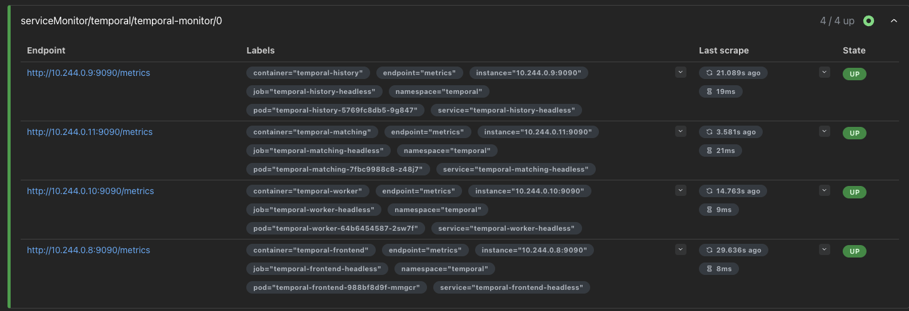
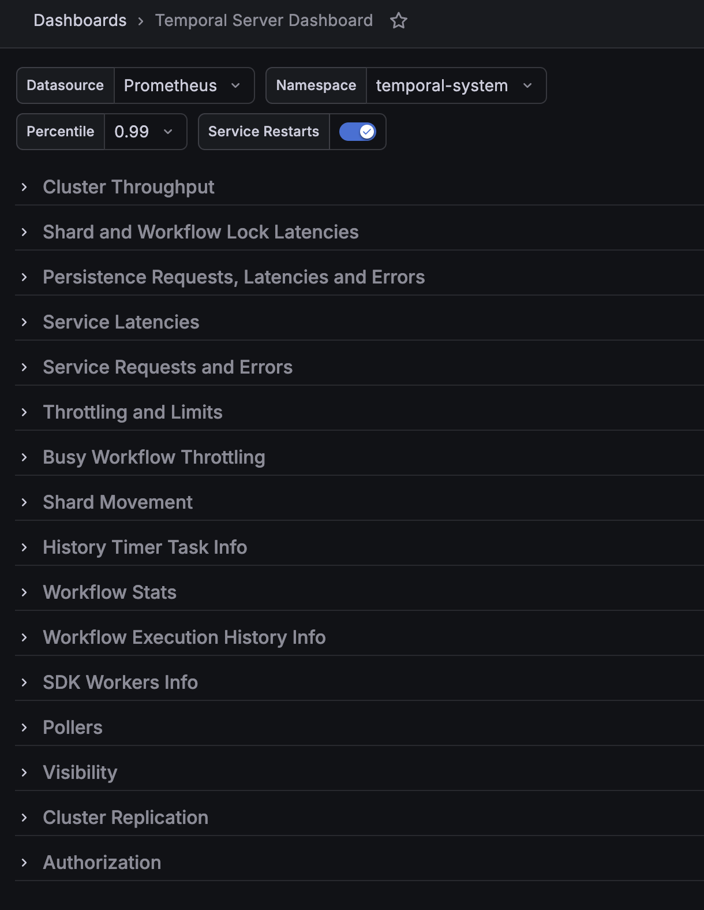

# Temporal OSS — Local Install Notes

> **Goal:** Get the system into a known-good state before running `helm install` for the Temporal helm chart.
> This guide stops before the Temporal helm install itself — that step follows the [temporalio/helm-charts](https://github.com/temporalio/helm-charts) docs directly.
>
> **Stack:** macOS · Docker (installed via Lumos, the enterprise app store) · minikube · PostgreSQL (Bitnami helm chart, in-cluster) · Helm v3

---

## Phase 1 — Prerequisites

Install the three tools needed before anything else. Docker is already installed.

### 1.1 Verify Docker is running

> Docker is provisioned through **Lumos**, the enterprise app store. If Docker is not installed, request it through Lumos before proceeding.

```bash
docker info
```

- [ ] Output shows `Server:` section with running context
- Watch for: `Cannot connect to the Docker daemon` — open Docker Desktop and wait for it to finish starting

---

### 1.2 Install kubectl

```bash
brew install kubectl
```

Verify:

```bash
kubectl version --client
```

- [ ] Output shows `Client Version:` with a version number

---

### 1.3 Install Helm v3

```bash
brew install helm
```

Verify:

```bash
helm version
```

- [ ] Output shows `version.BuildInfo` with `v3.x.x` or greater

---

### 1.4 Install minikube

```bash
brew install minikube
```

Verify:

```bash
minikube version
```

- [ ] Output shows `minikube version: v1.x.x`

---

## Phase 2 — Kubernetes Cluster

### 2.1 Start minikube with the Docker driver

```bash
minikube start --driver=docker
```

- [ ] Output ends with `Done! kubectl is now configured to use "minikube" cluster and "default" namespace by default`
- Watch for: first run pulls the minikube base image — this can take a few minutes on a slow connection
- Watch for: `Exiting due to PROVIDER_DOCKER_NOT_RUNNING` — Docker Desktop is not running, start it first

---

### 2.2 Verify the cluster is healthy

```bash
kubectl cluster-info
```

- [ ] Output shows `Kubernetes control plane is running at https://127.0.0.1:...`

```bash
kubectl get nodes
```

- [ ] One node listed with status `Ready`

---

### 2.3 Confirm kubectl context

```bash
kubectl config current-context
```

- [ ] Output is `minikube`
- If not: `kubectl config use-context minikube`

---

## Phase 3 — PostgreSQL Setup

All resources go into a dedicated `temporal` namespace to keep things clean and match common customer patterns.

### 3.1 Create the namespace

```bash
kubectl create namespace temporal
```

- [ ] Output: `namespace/temporal created`

---

### 3.2 Add the Bitnami Helm repo

```bash
helm repo add bitnami https://charts.bitnami.com/bitnami
helm repo update
```

- [ ] Output includes `"bitnami" has been added to your repositories`
- [ ] `helm repo update` completes without errors
- Note: As of August 2025, Bitnami moved to a paid model for most images. The PostgreSQL chart currently works under the free tier, but customers with strict registry policies or air-gapped environments may hit pull failures. If images fail to pull, check [Bitnami's announcement](https://github.com/bitnami/containers/issues/83267) for the current free tier scope.

---

### 3.3 Deploy PostgreSQL into the cluster

```bash
helm install postgresql bitnami/postgresql \
  --namespace temporal \
  --set auth.postgresPassword=temporal
```

- [ ] Output ends with `STATUS: deployed`
- Note: this sets the `postgres` superuser password to `temporal`. Fine for local use — do not use in production.
- Watch for (re-installs only): if you previously ran `helm uninstall postgresql` and are reinstalling, the old persistent volume (PVC) is still on disk and will retain the original password — the `--set auth.postgresPassword` flag is silently ignored. To fully reset, delete the PVC after uninstalling: `kubectl delete pvc -l app.kubernetes.io/name=postgresql -n temporal`

---

### 3.4 Wait for PostgreSQL to be ready

```bash
kubectl wait --for=condition=ready pod \
  -l app.kubernetes.io/name=postgresql \
  -n temporal \
  --timeout=120s
```

- [ ] Output: `pod/postgresql-0 condition met`
- Watch for: timeout after 120s — check pod status with `kubectl get pods -n temporal` and look for errors in `kubectl describe pod postgresql-0 -n temporal`

---

### 3.5 Create the two Temporal databases

```bash
kubectl exec -it postgresql-0 -n temporal -- \
  psql -U postgres -c "CREATE DATABASE temporal;"
```

```bash
kubectl exec -it postgresql-0 -n temporal -- \
  psql -U postgres -c "CREATE DATABASE temporal_visibility;"
```

- [ ] Each command returns `CREATE DATABASE`
- Watch for: `FATAL: password authentication failed` — the pod may not have fully initialized yet, wait 10s and retry

---

### 3.6 Locate the Bitnami-created Secret

The Bitnami chart automatically creates a Kubernetes Secret named `postgresql` in the `temporal` namespace. The Temporal helm chart can reference this directly — no need to create a separate secret.

Verify it exists:

```bash
kubectl get secret postgresql -n temporal -o jsonpath="{.data.postgres-password}" | base64 -d
```

- [ ] Output is `temporal` (the password you set in step 3.3)

---

## Phase 4 — Pre-flight Checklist

Run these checks before opening the Temporal helm chart docs. Everything should be green before proceeding.

### 4.1 PostgreSQL pod is healthy

```bash
kubectl get pods -n temporal -l app.kubernetes.io/name=postgresql
```

- [ ] Status is `Running`, Ready column shows `1/1`

---

### 4.2 Both databases exist

```bash
kubectl exec -it postgresql-0 -n temporal -- \
  psql -U postgres -c "\l"
```

- [ ] `temporal` appears in the database list
- [ ] `temporal_visibility` appears in the database list

---

### 4.3 Secret is in place

```bash
kubectl get secret postgresql -n temporal
```

- [ ] Secret exists, `DATA` column shows `1` (only `postgres-password` — expected when no custom username or replication is configured)

---

### 4.4 Add the Temporal Helm repo

```bash
helm repo add temporalio https://go.temporal.io/helm-charts
helm repo update
```

- [ ] `"temporalio" has been added to your repositories`

---

### 4.5 Verify the Temporal chart is available

```bash
helm search repo temporalio
```

- [ ] `temporalio/temporal` appears in results with a version number

---

## Ready to Install

At this point the system is prepped. You have:

- A running minikube cluster
- PostgreSQL running in the `temporal` namespace with both databases created
- A Kubernetes Secret with the DB password
- The Temporal helm repo registered

**Connection details for your `values.postgresql.yaml`:**

| Field    | Value                                   |
|----------|-----------------------------------------|
| host     | `postgresql.temporal.svc.cluster.local` |
| port     | `5432`                                  |
| user     | `postgres`                              |
| password | from secret `postgresql`, key `postgres-password` |
| db names | `temporal`, `temporal_visibility`       |

---

## Phase 5 — Temporal Helm Install

### 5.1 Download the values file

> The Temporal helm repo hosts only the chart itself — the example values files are not included. This is noted in the [README](https://github.com/temporalio/helm-charts/tree/main) but easy to miss when scanning for install steps. You must download the values file directly from GitHub.

In Helm, a values file is your configuration layer — it lets you customize the chart's defaults without modifying the chart code. Think of it as the set of answers you provide before the install runs.

In the Temporal Helm chart, `values.yaml` and `values.postgresql.yaml` represent a layered configuration relationship where `values.yaml` provides general defaults and `values.postgresql.yaml` provides specific overrides for using PostgreSQL as the backend database.

- `values.yaml` (The Base): This is the main configuration file that contains the global defaults for the entire Temporal cluster, such as service replicas, image tags, and resource limits.
- `values.postgresql.yaml` (The Override): This is a specialized configuration snippet designed to "pivot" the deployment to use PostgreSQL instead of the default. It contains the necessary persistence settings—such as database host, user, and driver details—to tell the Temporal server how to connect to a Postgres instance.

When you install the chart, you use the `-f` flag to merge these files. Helm performs a deep merge, meaning values in the second file override those in the first.

```bash
curl -O https://raw.githubusercontent.com/temporalio/helm-charts/main/charts/temporal/values/values.postgresql.yaml
```

- [ ] `values.postgresql.yaml` is present in your working directory

---

### 5.2 Edit the values file

The file ships with three placeholders: `_HOST_`, `_USERNAME_`, and `_PASSWORD_`. The file has two sections — `default` (workflow execution data) and `visibility` (search data) — and **both need the same changes**.

Open `values.postgresql.yaml` and make the following replacements in both sections:

**`connectAddr`** — replace the placeholder host:
```yaml
connectAddr: "postgresql.temporal.svc.cluster.local:5432"
```

**`user`** — replace the placeholder username:
```yaml
user: postgres
```

**`password`** — instead of pasting the password as plain text, replace the `password` line with a reference to the Bitnami secret we verified in step 3.6:
```yaml
existingSecret: postgresql
secretKey: postgres-password
```

- [ ] Both `default` and `visibility` sections have the correct `connectAddr`
- [ ] Both sections have `user: postgres`
- [ ] Both sections use `existingSecret: postgresql` and `secretKey: postgres-password` (no `password:` line)

---

### 5.3 Run the helm install

> The README examples do not include `--namespace temporal`. You must add it — without it, Temporal installs into the `default` namespace, separate from your PostgreSQL instance.

```bash
helm install --repo https://go.temporal.io/helm-charts \
  -f values.postgresql.yaml \
  temporal temporal \
  --namespace temporal \
  --timeout 900s
```

**What to expect:** the command will appear to sit doing nothing for several minutes. This is normal. Before any Temporal server pods start, the chart runs schema setup jobs as pre-install steps — these create all the tables Temporal needs inside the `temporal` and `temporal_visibility` databases. The 900 second timeout exists specifically to give those jobs time to finish.

- [ ] Command eventually returns `STATUS: deployed`
- Watch for: `Error: timed out waiting for the condition` — usually means the schema jobs couldn't reach PostgreSQL. Check with `kubectl get pods -n temporal` and look for failed jobs.

---

### 5.4 Verify all pods are running

```bash
kubectl get pods -n temporal
```

Expect pods for: `frontend`, `history`, `matching`, `worker`, `web`, and `admintools` — all with status `Running`.

- [ ] All Temporal pods show `Running` and `1/1` Ready
- Watch for: pods stuck in `Init` or `CrashLoopBackOff` — check with `kubectl logs <pod-name> -n temporal`

---

## Phase 6 — Connect Your Local Machine to the Cluster

### 6.1 Check that port 7233 is free

> If you have used the **Temporal Dev Server** (`temporal server start-dev`) previously, that process holds port 7233 and will silently intercept CLI commands meant for the cluster. Always check before port-forwarding.

```bash
lsof -i :7233
```

- [ ] Output is empty — nothing is using port 7233
- If `temporal` appears in the output: the Temporal Dev Server is running and must be stopped before continuing. Find the PID in the output and run `kill <PID>`, or stop it from whichever terminal it is running in.

---

### 6.2 Port-forward the Temporal frontend

Leave this running in a dedicated terminal. Your SDK and local `temporal` CLI will use this to reach the cluster:

```bash
kubectl port-forward services/temporal-frontend-headless 7233:7233 -n temporal
```

- [ ] Output shows `Forwarding from 127.0.0.1:7233 -> 7233`

---

### 6.3 Port-forward the Web UI

In a second dedicated terminal, leave this running too:

```bash
kubectl port-forward services/temporal-web 8080:8080 -n temporal
```

- [ ] Output shows `Forwarding from 127.0.0.1:8080 -> 8080`
- Open `http://127.0.0.1:8080` in your browser

---

### 6.4 Create the default namespace

> Run this via the admintools pod inside the cluster — not from your local terminal. This avoids any port ambiguity and guarantees you are talking to the cluster regardless of what is running locally.

```bash
kubectl exec temporal-admintools-<pod-id> -n temporal -- temporal operator namespace create default
```

Replace `<pod-id>` with your actual admintools pod name from step 5.4. Or look it up first:

```bash
kubectl get pods -n temporal -l app.kubernetes.io/name=temporal-admintools
```

- [ ] Output: `Namespace default successfully registered.`

---

### 6.5 Verify the namespace is visible in the Web UI

Navigate to `http://127.0.0.1:8080/namespaces` — the `default` namespace should now appear.

- [ ] `default` namespace visible in the Web UI

---

## Phase 7 — Prometheus and Grafana Installation

All Temporal services expose extensive amount of metrics for observability. These metrics are critical for performance tuning and troubleshooting. By installing Prometheus and Grafana, we will be able to collect these metrics, visualize them and create alerts.

The easiest way to install both is using the prometheus helm chart from the [community repo](https://prometheus-community.github.io/helm-charts). The `kube-prometheus-stack` includes Prometheus, Grafana, AlertManager, and useful exporters.

A couple of great blogs on this topic:

- [Working with Prometheus and Grafana Using Helm](https://www.geeksforgeeks.org/devops/working-with-prometheus-and-grafana-using-helm/)
- [Deploying Prometheus and Grafana with Helm](https://oneuptime.com/blog/post/2026-01-17-helm-prometheus-grafana-deployment/view)
- [A Complete Guide to Prometheus, Grafana, and ServiceMonitors](https://saraswathilakshman.medium.com/a-complete-guide-to-prometheus-grafana-and-servicemonitors-fcc104dc3087)

### 7.1 Add the Prometheus Helm repo

```bash
helm repo add prometheus-community https://prometheus-community.github.io/helm-charts/
helm repo update
```

- [ ] `"prometheus-community" has been added to your repositories`

---

### 7.2 Verify the Prometheus chart is available

```bash
helm search repo kube-prometheus-stack
```

- [ ] `prometheus-community/kube-prometheus-stack` appears in results with a version number

---

### 7.3 Install the Helm chart

Install the chart with default settings. For production deployment, custom values need to be configured (cpu, memory etc.)

```bash
helm install prometheus prometheus-community/kube-prometheus-stack -n temporal
```

### 7.4 Verify the installation

```bash
# Check all pods are running
kubectl get pods -n temporal | grep prometheus

# Check services
kubectl get svc -n temporal | grep prometheus

# Port forward, to check that Prometheus is scraping targets
kubectl port-forward svc/prometheus-kube-prometheus-prometheus 9090:9090 -n temporal
```
Open http://localhost:9090/targets, you should see all the targests Prometheus is scraping metrics from. 

### 7.5 Scrape metrics from Temporal services

We need to deploy a ServiceMonitor to scrape Temporal metrics. A ServiceMonitor is a Custom Resource Definition (CRD) introduced by the Prometheus Operator. It tells Prometheus exactly which Kubernetes Services to monitor and how to find their metrics endpoints. 

The file `servicemonitor.yaml` contains with the following content. We are basically scraping all `/metrics` endpoints from the `temporal` namespace.

```bash
# servicemonitor.yaml
apiVersion: monitoring.coreos.com/v1
kind: ServiceMonitor
metadata:
  name: temporal-monitor
  namespace: temporal
  labels:
    release: prometheus
spec:
  selector:
    matchLabels:
      app.kubernetes.io/headless: 'true'
  namespaceSelector:
    matchNames:
      - temporal
  endpoints:
    - port: metrics
      path: /metrics
      interval: 30s
      scrapeTimeout: 10s
```

Deploy the ServiceMonitor:

```bash
kubectl apply -f servicemonitor.yaml
```

### 7.6 Verify Temporal metrics targets

Got to http://localhost:9090/targets, you should see all four Temporal services listed. Similar to this:  



### 7.6 Find out Grafana password for the `admin` user

A random password was generated for the default Grafana user `admin` during installation. You can find out the password by running the following command.

```bash
kubectl get secret prometheus-grafana -n temporal -o jsonpath="{.data.admin-password}" | base64 --decode
```

You should see something like this: `AIwGCx4ASUZAD2ffedBWa48HRAWLx1k8oQ30p7rk`

### 7.6 Port-forward the Grafana UI

With the password handy, we now can log into Grafana. Go to http://localhost:3000, and log in with the user `admin` and the password above.

### 7.7 Import the Temporal server dashboard

Tiho created a wonderful [Grafana dashboard](https://github.com/tsurdilo/temporal-server-operations/tree/main/metrics/dashboards/server) that provides in-depth observability for all the Temproal services.

Import the dashboard into Grafana. It looks like this. Feel free to explore the metrics.



---

## Phase 8 — Deploy a workflow to your cluster (optional)

With everything running, you can validate your installation by deploy the [money transfer workflow](https://learn.temporal.io/getting_started/java/first_program_in_java/) to your cluster. 

---

## Daily Use — Bringing the Cluster Up

Use this after the initial install is complete. Every time you want to work with your local Temporal cluster.

### Manual

Start minikube (skip if already running):
```bash
minikube start --driver=docker
```

Terminal 1 — leave running:
```bash
kubectl port-forward services/temporal-frontend-headless 7233:7233 -n temporal
```

Terminal 2 — leave running:
```bash
kubectl port-forward services/temporal-web 8080:8080 -n temporal
```

Web UI: `http://localhost:8080` · SDK/CLI: `localhost:7233`

---

### Script

```bash
./start-temporal.sh
```

Handles the Temporal Dev Server port conflict check, starts minikube if needed, waits for pods to be ready, and starts both port-forwards in the background — so you only need one terminal.

To stop:
```bash
./stop-temporal.sh
```

---

## Quick Reference — Useful Commands

```bash
# Check all resources in the temporal namespace
kubectl get all -n temporal

# Tail Temporal server logs (once installed)
kubectl logs -f -l app.kubernetes.io/name=temporal -n temporal

# Restart minikube if needed
minikube stop && minikube start --driver=docker

# Tear everything down
minikube delete
```
